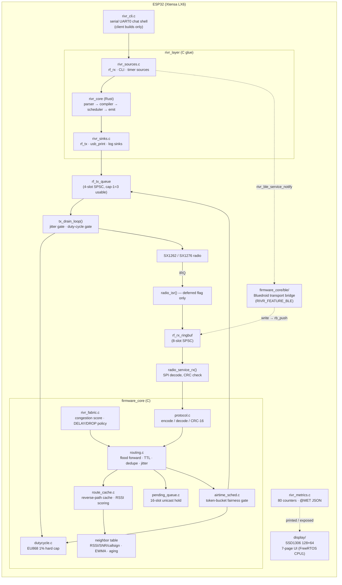
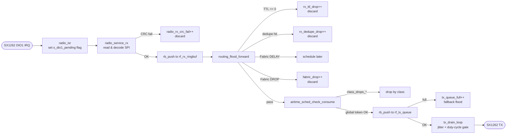
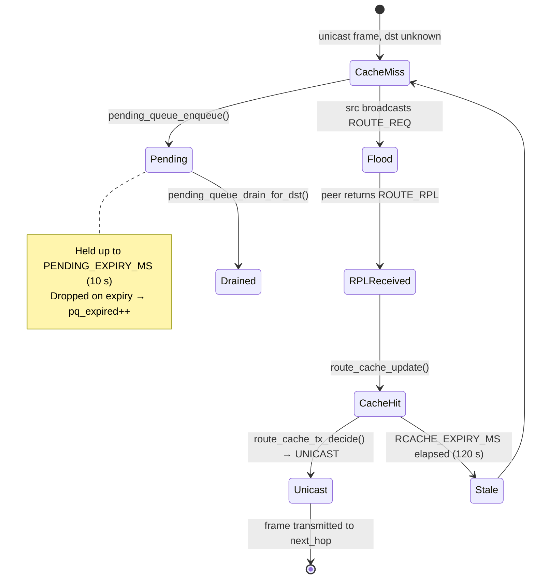
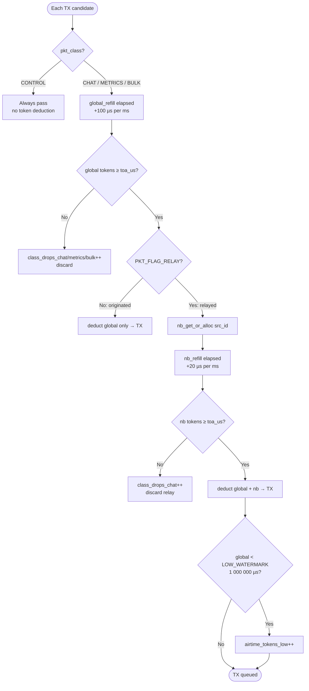

# RIVR Architecture

Detailed system architecture of the RIVR embedded mesh runtime.

---

## 1. High-Level Component Map



---

## 2. Boot Sequence

```mermaid
sequenceDiagram
    participant AppMain as app_main()
    participant Radio as radio_sx1262.c
    participant Embed as rivr_embed.c
    participant NVS as ESP-IDF NVS
    participant Tick as main loop

    AppMain->>Radio: radio_init()
    Radio->>Radio: SPI init · TCXO · PaConfig · frequency · SF/BW/CR
    Radio->>Radio: radio_start_rx()
    AppMain->>NVS: nvs_get_blob("rivr_prog")
    NVS-->>AppMain: RIVR source or default_program.h
    AppMain->>Embed: rivr_embed_init(prog_src)
    Embed->>Embed: parse → compile → bind sources/sinks
    AppMain->>AppMain: rivr_ble_init() [#if !RIVR_SIM_MODE]
    Note right of AppMain: Bluedroid BLE started;<br/>BOOT_WINDOW active (120 s)
    AppMain->>Tick: loop forever

    loop Every ~1 ms
        Tick->>Radio: radio_service_rx()
        Radio-->>Tick: frame(s) → rf_rx_ringbuf
        Tick->>Embed: rivr_tick()
        Tick->>AppMain: rivr_ble_tick() [timeout check]
        Tick->>Tick: tx_drain_loop()
    end
```

---

## 3. RX Frame Pipeline



---

## 4. Routing State Machine



---

## 5. Airtime Token Budget



---

## 6. Memory Map (BSS only, no heap after init)

| Structure | Size (bytes) | Count | Total |
|---|---|---|---|
| `rf_rx_ringbuf` | 255 × 8 | 1 | ~2 KB |
| `rf_tx_queue` | 255 × 4 | 1 | ~1 KB |
| `dedupe_cache_t` | ~16 × 8 | 1 | ~128 B |
| `neighbor_table_t` | ~64 × 16 | 1 | ~1 KB |
| `route_cache_t` | ~40 × 16 | 1 | ~640 B |
| `pending_queue_t` | ~280 × 16 | 1 | ~4.5 KB |
| `airtime_ctx_t` | ~12 + 16×12 | 1 | ~216 B |
| `rivr_fabric_ctx_t` | ~80 | 1 | ~80 B |
| RIVR engine (Rust) | fixed compile-time | 1 | ~2 KB |
| **Total** | | | **~12 KB** |

All buffers allocated statically in BSS. `rivr_embed_init()` parses the RIVR source from a stack-allocated cursor — no heap is touched after boot.

---

## 7. Packet Wire Format

```
Byte offset  Field          Type    Notes
───────────  ─────────────  ──────  ───────────────────────────────────────
0–1          magic          u16 LE  0x5256 = "RV"
2            version        u8      1
3            pkt_type       u8      PKT_CHAT=1, BEACON=2, … PROG_PUSH=7, TELEMETRY=8, MAILBOX=9, ALERT=10
4            flags          u8      PKT_FLAG_RELAY=0x02, FALLBACK=0x04
5            ttl            u8      Default 7; decremented each hop
6            hop            u8      0 at origin; incremented each hop
7–8          net_id         u16 LE  Network discriminator
9–12         src_id         u32 LE  Sender unique node ID
13–16        dst_id         u32 LE  0 = broadcast
17–20        seq            u32 LE  Per-source monotonic counter
21           payload_len    u8      0–231 bytes
22…          payload        bytes   Application data
+payload+0   CRC low        u8      CRC-16/CCITT (init=0xFFFF, poly=0x1021)
+payload+1   CRC high       u8
───────────────────────────────────────────────────────────────────────────
Minimum frame = 24 bytes (0 payload); maximum = 255 bytes
```

---

## 8. Multi-Layer Congestion Control

Three independent layers stack in order:

```
Incoming frame
    │
    ▼
① Fabric score gate (repeater builds only)
   ─ 60 s sliding-window congestion score per network
   ─ DELAY: schedule forward later; DROP: discard if score > threshold
    │
    ▼
② Airtime token-bucket (all builds)
   ─ Global: 10 s × 10 % = 10 000 000 µs capacity, 100 µs/ms refill
   ─ Per-neighbour (relay only): 2 s × 2 % = 2 000 000 µs capacity
   ─ CONTROL class always bypasses
    │
    ▼
③ EU868 duty-cycle hard cap (all builds)
   ─ 36 s/hour (1 %) sliding window, no override
   ─ duty_blocked++ when blocked
    │
    ▼
 rf_tx_queue → tx_drain_loop → SX1262 TX
```

---

## 9. BLE Transport Bridge

The optional BLE bridge (`firmware_core/ble/`, enabled with `RIVR_FEATURE_BLE=1`) provides a
local edge interface for the Rivr companion app using the Nordic UART Service (NUS) profile.
It is **not** a second protocol — the same binary Rivr wire frames used over LoRa are sent and
received over BLE.

### GATT service layout (Nordic NUS)

| Characteristic | UUID | Direction | Description |
|---|---|---|---|
| Service | `6E400001-B5A3-F393-E0A9-E50E24DCCA9E` | — | Nordic UART Service |
| RX (phone→node) | `6E400002-…` | WRITE / WRITE_NO_RSP | App writes outgoing Rivr frames; injected into `rf_rx_ringbuf` |
| TX (node→phone) | `6E400003-…` | NOTIFY | Node notifies on every received LoRa frame |

### Activation modes

| Mode | Constant | Lifetime |
|---|---|---|
| Boot window | `RIVR_BLE_MODE_BOOT_WINDOW` | 120 s after boot |
| Button | `RIVR_BLE_MODE_BUTTON` | 300 s after trigger |
| App-requested | `RIVR_BLE_MODE_APP_REQUESTED` | Until explicitly deactivated |

### BLE data flow

```
Phone app                          ESP32 (Bluedroid BT host)

          ─── WRITE RX char ──►  ESP_GATTS_WRITE_EVT
                                  └─ rivr_ble_service_handle_rx_write()
                                     └─ rb_try_push(&rf_rx_ringbuf, &frame)
                                     └─ processed by main loop as if LoRa frame

rivr_fabric_on_rx() ─────────────► rivr_ble_service_notify(handle, data, len)
                                  └─ esp_ble_gatts_send_indicate(TX char)
                                 ─── NOTIFY TX char ──► companion app
```

### Thread safety

Bluedroid dispatches GATT callbacks from the BT host context and is the **producer** to
`rf_rx_ringbuf`. The main loop is the **consumer**. This is the same SPSC pattern used for the
SX1262 ISR path, so no mutex is needed. `esp_ble_gatts_send_indicate()` is used for TX notify.

### Enabling BLE

**Fastest path — use a pre-built BLE environment:**

```bash
# Replace <board> with your board variant name, e.g. esp32devkit_e22_900
pio run -e client_<board>_ble -t upload
```

All six supported boards have a `client_<board>_ble` environment in their
`variants/<board>/platformio.ini` that already sets both required options:

| Pre-built environment | Board |
|---|---|
| `client_esp32devkit_e22_900_ble` | ESP32 DevKit + E22-900M30S |
| `client_lilygo_lora32_v21_ble` | LilyGo LoRa32 v2.1 (SX1276) |
| `client_heltec_lora32_v2_ble` | Heltec WiFi LoRa 32 V2 (SX1276) |
| `client_heltec_lora32_v3_ble` | Heltec WiFi LoRa 32 V3 (ESP32-S3) |
| `client_lilygo_t3s3_ble` | LilyGo T3-S3 (ESP32-S3) |
| `client_lilygo_tbeam_sx1262_ble` | LilyGo T-Beam v1.1 (SX1262) |

**Manual / custom-board setup:**

1. Add `sdkconfig.ble` to the build: in `platformio.ini`:
   ```ini
   board_build.cmake_extra_args =
       "-DSDKCONFIG_DEFAULTS=sdkconfig.defaults;sdkconfig.ble"
   ```
2. Add the feature flag:
   ```ini
   build_flags = -DRIVR_FEATURE_BLE=1
   ```
3. Flash normally — `rivr_ble_init()` is called automatically at boot.

RAM cost depends on the ESP-IDF Bluedroid configuration in `sdkconfig.ble`.
When `RIVR_FEATURE_BLE=0` all BLE calls compile to empty inlines; no RAM is allocated.
